# DOSSIÊ DE DOCUMENTAÇÃO DO SISTEMA
## Auto Gestão de Direção — Living System Dossier & Master Registry

> **Diretriz de Manutenção e Governança Contínua:**  
> Este documento é o **registro vivo e mestre** de todo o ecossistema do *Auto Gestão de Direção*. Ele consolida a visão arquitetural, o inventário completo de código e recursos, o modelo de dados e a **linha do tempo cronológica de todos os aperfeiçoamentos e inserções**.  
> **Regra Obrigatória:** Toda e qualquer nova funcionalidade, alteração de banco de dados, refatoração de código ou inclusão de arquivo deve registrar formalmente uma nova entrada na [Seção 6 — Registro Cronológico de Inserções e Aperfeiçoamentos](#6-registro-cronológico-de-inserções-e-aperfeiçoamentos).

---

## 1. Visão Geral e Propósito

O **Auto Gestão de Direção** é uma plataforma inovadora criada para modernizar e digitalizar o ecossistema de formação de condutores, atendendo tanto **Instrutores Autônomos de Trânsito** quanto **Centros de Formação de Condutores (CFCs / Autoescolas)** e seus **Alunos**.

A solução une três pilares estratégicos fundamentais:
1. **Gestão Operacional e Financeira**: Controle rigoroso de agenda, alunos, frotas, pacotes de aulas e recebimentos com isolamento seguro multi-tenant.
2. **Portal do Aluno Gamificado**: Ambiente onde o estudante acompanha seu progresso em tempo real, níveis, árvore de habilidades práticas e medalhas de mérito.
3. **Simulador Pedagógico 2D de Trânsito (Motor Canvas & IA CTB)**: Simulador gamificado com motor de física, inteligência artificial autônoma que cumpre 100% dos ritos do Código de Trânsito Brasileiro (CTB), retrovisores funcionais, sinalização viária completa, pedestres, bolsão de motos e veículos prioritários com áudio 3D posicional.

---

## 2. Mapa Arquitetural dos Módulos

```mermaid
graph TD
    A[Auto Gestão de Direção] --> B[Módulo 1: Gestão Operacional & Financeira]
    A --> C[Módulo 2: Portal do Aluno & Gamificação]
    A --> D[Módulo 3: Simulador Gamificado CTB]
    A --> E[Módulo 4: Camada de Dados & Persistência]
    A --> F[Módulo 5: Infraestrutura & Nuvem]

    B --> B1[Agenda Inteligente sem conflitos]
    B --> B2[Gestão de Alunos & Veículos]
    B --> B3[Financeiro: Pacotes, Parcelas & Centavos]
    B --> B4[Multi-Tenancy por organizacao_id]

    C --> C1[Autenticação & Sessão do Aluno]
    C --> C2[Gamificação: XP, Níveis & 10 Habilidades]
    C --> C3[Conquistas, Medalhas & Sessões]

    D --> D1[Modo Demo IA Autônoma 100% CTB]
    D --> D2[Modo Manual do Aluno]
    D --> D3[Retrovisores Esquerdo, Central e Direito]
    D --> D4[Cenário Vivo: Semáforos, Bolsão Motos, Escola]
    D --> D5[Veículos Prioritários SAMU, Polícia, Trem com Áudio 3D]

    E --> E1[LocalStorage Protótipo v0.1]
    E --> E2[PostgreSQL / Neon Data API]
    E --> E3[Modelo com 14 Entidades Relacionais]

    F --> F1[Netlify Deploy + Redirects]
    F --> F2[Neon Lakebase Postgres]
    F --> F3[Neon Config neon.ts + Auth + Data API]
    F --> F4[Neon MCP & Agent Skills]
```

---

## 3. Detalhamento dos Componentes e Subsistemas

### 3.1. Módulo 1 — Gestão Operacional & Financeira (Painel do Instrutor / CFC)
- **Localização:** `src/modules/instructor/app.js`, `src/core/domain.js`, `public/css/styles.css`.
- **Capacidades Operacionais:**
  - **Multi-tenancy:** Alternância de tenant em tempo real (`org-auto` para autônomos e `org-cfc` para autoescolas), isolando registros por `organizacao_id`.
  - **Agenda de Aulas:** Validação algorítmica de conflitos de horário com restrição semiaberta `[início, fim)`, impedindo choques simultâneos de aluno, instrutor ou veículo.
  - **Gestão de Cadastros:** Cadastro de alunos com status e telefones de contato; cadastro de veículos com placas regulamentadas e categoria (A, B, A/B).
  - **Financeiro em Centavos:** Todo valor monetário é manipulado como inteiro em centavos (sem arredondamentos de ponto flutuante).
  - **Ciclo de Pacotes e Contas a Receber:** Um pacote cria uma única conta a receber; o consumo reduz o saldo de aulas sem gerar novas cobranças; pagamentos parciais preservam o saldo aberto devedor.
  - **Exportação:** Relatórios com gráficos mensais e exportação de grade de aulas para CSV.

### 3.2. Módulo 2 — Portal do Aluno & Gamificação Pedagógica
- **Localização:** `src/modules/student/student-portal.js`, `src/auth/student-auth.js`, `src/modules/student/student-app.js`, `public/css/student-styles.css`.
- **Capacidades:**
  - **Autenticação:** Cadastro e login com credenciais de acesso, gerenciamento de sessão ativa e conta demo integrada (`aluno@demo.com`).
  - **Motor de XP & Níveis:** Conversão contínua de pontos de experiência adquiridos nas práticas (`xpForLevel = level * 200`).
  - **Árvore de 10 Habilidades Práticas:** Controle do veículo, percepção espacial, estacionamento, baliza, distância segura, esterçamento, correção de trajetória, uso de retrovisores, direção defensiva/segurança e precisão.
  - **Painel de Conquistas:** Medalhas por metas pedagógicas cumpridas e registro de cenários concluídos com telemetria da sessão.

### 3.3. Módulo 3 — Simulador Gamificado 2D de Trânsito & Motor de Física CTB
- **Localização:** `simulator/src/simulator-engine.js`, áudios em `simulator/public/sons/` e auditorias em `simulator/tests/`.
- **Capacidades e Física:**
  - **Dois Modos de Condução:**
    - *Modo IA Autônoma (Default):* Conduz o veículo automaticamente respeitando rigorosamente o CTB — para antes de faixas de pedestres, aguarda semáforos, dá preferência a pedestres e veículos prioritários, aciona setas antes das manobras e posiciona-se no bolsão de motos.
    - *Modo Manual:* Controle direto pelo aluno com teclado (setas, espaço para freio) ou comandos visuais na tela.
  - **Espelhos Retrovisores em Tempo Real:** Retrovisor Central, Esquerdo e Direito renderizados no topo da tela com projeção reversa de veículos e elementos que se aproximam por trás, incluindo indicação visual de pontos cegos.
  - **Ambiente Urbano Completo:**
    - Cruzamentos regulados por semáforos com ciclos automáticos (Verde, Amarelo, Vermelho).
    - Faixas de pedestres, travessias escolares e pontos de parada de ônibus obrigatórios.
    - Bolsão de motos (espaço regulamentar do CTB entre os carros e a faixa de pedestres no sinal vermelho).
    - Passagem de nível com linha férrea sinalizada.
  - **Sistema de Veículos Prioritários & Emergenciais:**
    - Veículos proceduralmente ativados: Ambulância (SAMU), Viatura Policial e Trem de Carga.
    - Física de preferência de passagem: parada obrigatória ou deslocamento para a faixa da direita para desobstrução da via.
  - **Áudio Espacial Estéreo 3D:** Motor Web Audio API que calcula a distância euclidiana e o ângulo do veículo emissor em relação ao condutor, modulando volume proporcional e pan estéreo (esquerda/direita) dos efeitos sonoros (`ambulance.mp3`, `police.mp3`, `train.mp3`).

### 3.4. Módulo 4 — Modelo de Dados e Persistência
- **Localização:** `docs/MODELO_DADOS.md`, `neon.ts`.
- **Status:** Operando em LocalStorage no protótipo frontend; estrutura relacional planejada e pronta para persistência em PostgreSQL (Neon).
- **Entidades Definidas:**
  1. `organizacao`: ID, tipo (AUTONOMO/CFC), nome, fuso, ativa.
  2. `usuario`: ID, nome, email, status.
  3. `vinculo_usuario`: organizacao_id, usuario_id, papel, permissoes.
  4. `aluno`: ID, organizacao_id, nome, telefone, categoria, processo_status_interno.
  5. `instrutor`: ID, organizacao_id, nome, categoria, validade_informada.
  6. `veiculo`: ID, organizacao_id, placa, modelo, categoria, validade_informada.
  7. `aula`: ID, organizacao_id, aluno_id, instrutor_id, veiculo_id, inicio, fim, status_local, status_integracao, ocorrencia, criada_por.
  8. `historico_aula`: ID, aula_id, evento, de, para, ocorrido_em, ator_id.
  9. `pacote`: ID, organizacao_id, aluno_id, nome, quantidade, saldo_aulas, valor_centavos, status.
  10. `conta_receber`: ID, organizacao_id, aluno_id, pacote_id, descricao, valor_centavos, vencimento, status, origem.
  11. `pagamento`: ID, organizacao_id, conta_receber_id, valor_centavos, recebido_em, meio, referencia.
  12. `despesa`: ID, organizacao_id, descricao, valor_centavos, vencimento, pago_em, status.
  13. `estorno`: ID, organizacao_id, lancamento_original_id, valor_centavos, motivo, criado_em.
  14. `auditoria`: ID, organizacao_id, ator_id, entidade, entidade_id, acao, instante, metadados_minimos.

### 3.5. Módulo 5 — Infraestrutura de Nuvem, Deploy e Integrações
- **Deploy de Produção:** Netlify configurado via `netlify.toml` publicando `public` após copiar `src` na etapa de build, com fallback no `index.html` da raiz.
- **Backend Serverless Neon (PostgreSQL):**
  - CLI Neon v8.0.12 instalada e homologada.
  - `neon.ts` configurado para declarar `auth: true` (Managed Better Auth) e `dataApi: true`.
  - Neon Data API Endpoint: `https://ep-lucky-river-b6lcmj3l.apirest.c-2.sa-east-1.aws.neon.tech/neondb/rest/v1`.
  - Skills de IA Neon instaladas no projeto: `neon`, `neon-ai-gateway`, `neon-auth`, `neon-functions`, `neon-object-storage`, `neon-postgres`, `neon-postgres-branches`, `neon-postgres-egress-optimizer`.
  - MCP Server Neon (`https://mcp.neon.tech/mcp`) integrado globalmente no Antigravity IDE.

---

## 4. Inventário Completo de Arquivos do Repositório

| Arquivo / Diretório | Propósito e Responsabilidade |
| :--- | :--- |
| `docs/DOSSIE_DO_SISTEMA.md` | **Dossiê mestre de documentação**, inventário geral e cronologia viva de aperfeiçoamentos do sistema. |
| `index.html` | Página raiz de inicialização e redirecionamento suave para a versão ativa do protótipo no Netlify/servidor web. |
| `netlify.toml` | Configuração de publicação estática e regras de redirecionamento 301 do Netlify. |
| `neon.ts` | Arquivo de Infraestrutura como Código (IaC) do Neon, declarando serviços de Auth, Data API e políticas de branch. |
| `package.json` | Manifesto de dependências do ecossistema e pacotes de configuração da nuvem Neon. |
| `skills-lock.json` | Lockfile de versionamento das skills de IA do Neon instaladas no workspace. |
| `.gitignore` | Regras de exclusão do controle de versão (bloqueio de zips, temporários e logs). |
| `AGENTE_SIMULADOR_GAMIFICADO_DIRECAO.md` | Especificação completa do agente de desenvolvimento e regras do simulador gamificado de trânsito. |
| `AGENTE_DARK_PIXEL_CINEMATIC.md` | Diretrizes de direção de arte, design cinematográfico escuro e estética pixel/vetorial moderna. |
| `Prompt_Master_Auto_Gestao_de_Direcao.md` | Especificação fundamental de negócio, visão do fundador e requisitos originais da plataforma. |
| `sons/` | Repositório de arquivos de áudio de alta fidelidade: `ambulance.mp3`, `police.mp3`, `train.mp3`. |
| `.agents/skills/` | Pacotes de habilidades instaladas da Neon para o assistente de IA. |
| `public/index.html` | Aplicação web principal (Interface do Aluno, Instrutor, Simulador e Gestão). |
| `src/modules/instructor/app.js` | Lógica central da interface operacional de gestão (painéis, agendas, cadastros, finanças). |
| `src/core/domain.js` | Módulo com funções puras de regra de negócio (conflitos de agenda, cálculo de saldo, rateios). |
| `public/css/styles.css` | Folha de estilos moderna do painel gerencial operacional. |
| `src/modules/student/student-portal.js` | Interface visual do Portal do Aluno (cards de progresso, habilidades, conquistas). |
| `src/auth/student-auth.js` | Sistema de autenticação, sessões, hashing e persistência de dados do aluno. |
| `src/modules/student/student-app.js` | Controlador de inicialização e transições de tela do estudante. |
| `public/css/student-styles.css` | Design system gamificado do Portal do Aluno. |
| `simulator/src/simulator-engine.js` | Motor de física 2D, renderizador Canvas, inteligência artificial CTB e retrovisores. |
| `tests/test-domain.cjs` | Testes automatizados de unidade para validação das regras de negócio do domínio. |
| `simulator/tests/` | Bateria de testes automatizados do simulador (`simulator-ctb-audit.cjs`, `test-demo-mode.cjs`, `test-continuous-demo.cjs`). |
| `simulator/public/sons/` | Cópia sincronizada dos recursos de áudio espacial para o contexto da pasta v0.1. |
| `Auto_Gestao_de_Direcao_v0.1/README.md` | Guia de execução local rápida do protótipo v0.1. |
| `docs/PROGRESSO.md` | Diário dos primeiros ciclos de validação de aceitação do MVP. |
| `docs/DECISOES.md` | Registro de decisões técnicas de arquitetura (ADRs D-001 a D-005). |
| `docs/ESCOPO_MVP.md` | Definição formal do escopo da primeira fatia de produto. |
| `docs/MODELO_DADOS.md` | Modelo de dados conceitual e regras de integridade do banco relacional. |
| `docs/PESQUISA_INTEGRACOES.md` | Documento de pesquisa sobre integração com catálogo de serviços oficiais do Denatran/Senatran. |
| `docs/ORIGEM_IDEIA.md` | Contexto de origem do projeto e histórico inicial. |

---

## 5. Matriz de Status das Funcionalidades

| Funcionalidade | Estado Atual | Tecnologia Atual | Próximo Passo |
| :--- | :---: | :--- | :--- |
| **Painel Operacional do CFC/Instrutor** | Estável | HTML5 + Vanilla JS + LocalStorage | Conectar à Neon Data API |
| **Prevenção de Choques de Horários** | Estável | `domain.js` (Funções puras) | Validar por Constraint/Trigger no Postgres |
| **Gestão Financeira & Pacotes** | Estável | Centavos inteiros em LocalStorage | Persistir em tabelas `pacote` e `conta_receber` |
| **Portal do Aluno & XP** | Estável | LocalStorage + `student-auth.js` | Migrar para Neon Auth (Managed Better Auth) |
| **Simulador de Direção (Canvas 2D)** | Estável | Canvas 2D + Web Audio API | Salvar telemetria e faltas no banco de dados |
| **IA Autônoma Condução CTB** | Estável | Algoritmo determinístico no Canvas | Expandir cenários com rotatórias e aclives |
| **Áudio Espacial 3D (SAMU/Polícia/Trem)** | Estável | Web Audio API PannerNode | Novas sirenes e efeitos de motor/buzina |
| **Deploy em Produção** | Ativo | Netlify | Configurar domínio próprio / SSL personalizado |
| **Banco de Dados Relacional** | Em Estruturação | Neon PostgreSQL / Data API | Criar tabelas e políticas de RLS |

---

## 6. Registro Cronológico de Inserções e Aperfeiçoamentos

> **Instruções para novos lançamentos:** Toda alteração significativa deve receber um novo bloco numerado abaixo, contendo data, título, tipo de mudança, arquivos afetados e resumo da entrega.

### [2026-09-27] — Ciclo 1: Concepção do MVP Operacional e Regras de Domínio
- **Tipo:** Criação / Core Feature
- **Arquivos:** `src/modules/instructor/app.js`, `domain.js`, `test-domain.cjs`, `styles.css`, `index.html`.
- **Descrição:**
  - Primeira entrega executável demonstrativa da gestão operacional de aulas práticas para autônomos e CFCs.
  - Implementação das funções puras de domínio: detecção de sobreposição de horários, cálculo de saldo aberto, consumo de pacote e divisão multi-tenant.
  - Criação da documentação inicial de arquitetura (`MODELO_DADOS.md`, `DECISOES.md`, `ESCOPO_MVP.md`).

---

### [2026-10-02] — Ciclo 2: Portal do Aluno Gamificado e Sistema de Habilidades
- **Tipo:** Nova Funcionalidade (Portal do Aluno)
- **Arquivos:** `student-auth.js`, `student-portal.js`, `student-app.js`, `student-styles.css`.
- **Descrição:**
  - Criação do módulo de autenticação local do estudante com conta demo pronta.
  - Implementação da árvore de 10 habilidades práticas de direção veicular.
  - Introdução do sistema de pontos de experiência (XP), cálculo progressivo de níveis e galeria de medalhas/conquistas.

---

### [2026-10-03] — Ciclo 3: Motor do Simulador Gamificado 2D com Regras do CTB
- **Tipo:** Nova Funcionalidade (Simulador)
- **Arquivos:** `simulator-engine.js`, `sons/police.mp3`, `sons/ambulance.mp3`, `sons/train.mp3`.
- **Descrição:**
  - Construção do motor de simulação gráfica 2D baseado em Canvas HTML5.
  - Adição de sinalização horizontal e vertical baseada no Código de Trânsito Brasileiro (CTB).
  - Implementação do sistema de áudio posicional 3D via Web Audio API para veículos de urgência e ferrovia.

---

### [2026-10-04] — Ciclo 4: Centralização de Faixa e Correção de Dinâmica
- **Tipo:** Correção / Refinamento
- **Arquivos:** `simulator-engine.js`.
- **Descrição:**
  - Correção na centralização automática do veículo na faixa regulamentar da direita.
  - Aprimoramento da detecção dinâmica de faixas de rodagem para evitar oscilações na trajetória.

---

### [2026-10-04] — Ciclo 5: Imobilização do Veículo e Exigência de Comandos
- **Tipo:** Ajuste de Física
- **Arquivos:** `simulator-engine.js`.
- **Descrição:**
  - Implementação da regra de física de parada: veículo imobilizado completamente ao zerar aceleração.
  - Exigência de comando explícito para retomada de marcha à frente ou ré.

---

### [2026-10-05] — Ciclo 6: Sistema de Eventos Aleatórios (SAMU, Polícia e Trem)
- **Tipo:** Nova Funcionalidade
- **Arquivos:** `simulator-engine.js`, `sons/`.
- **Descrição:**
  - Algoritmo de ativação procedural e aleatória de veículos de socorro e trem de carga durante a rodagem.
  - Ajuste de prioridade de passagem e verificação de resposta defensiva do condutor.

---

### [2026-10-05] — Ciclo 7: IA Autônoma com 100% de Aderência ao CTB e Modo Manual
- **Tipo:** Inteligência Artificial / Modo Demo
- **Arquivos:** `simulator-engine.js`, `tests/test-demo-mode.cjs`, `tests/test-continuous-demo.cjs`.
- **Descrição:**
  - Implementação do Modo Demonstração com Inteligência Artificial que cumpre integralmente todas as paradas, setas, faixas e ritos do CTB de forma autônoma.
  - Separação clara entre Modo IA e Modo Manual (condução pelo aluno).
  - Bateria de testes e auditoria automatizada de conformidade CTB (`simulator-ctb-audit.cjs`).

---

### [2026-10-06] — Ciclo 8: Quarteirões Urbanos, Bolsão de Motos e Retrovisores Funcionais
- **Tipo:** Geometria Viária / Visão do Condutor
- **Arquivos:** `simulator-engine.js`, `public/index.html`.
- **Descrição:**
  - Expansão do traçado para quarteirões urbanos realistas com cruzamentos perpendiculares.
  - Introdução do bolsão de motos (área de espera exclusiva entre carros e semáforo, conforme art. do CTB).
  - Criação da câmera de espelhos retrovisores em tempo real (retrovisor central e espelhos externos) com monitoramento de tráfego que vem de trás.

---

### [2026-10-06] — Ciclo 9: Otimização de Performance e Estabilização do Cenário
- **Tipo:** Correção de Bugs / Estabilidade
- **Arquivos:** `simulator-engine.js`.
- **Descrição:**
  - Resolução definitiva de gargalos e travamentos de memória na renderização contínua do Canvas.
  - Configuração do Modo IA como padrão inicial para exibição fluida instantânea ao carregar a página.
  - Sincronização retrógrada do cenário, fixação do ponto de ônibus e travessia escolar estável.

---

### [2026-10-07] — Ciclo 10: Estruturação para Publicação e Deploy no Netlify
- **Tipo:** Infraestrutura / Deploy
- **Arquivos:** `netlify.toml`, `index.html` (raiz).
- **Descrição:**
  - Criação do arquivo de publicação do Netlify (`netlify.toml`) apontando para `public`.
  - Adição de regras de redirecionamento 301 para harmonizar URLs diretas.
  - Criação do `index.html` raiz com auto-redirecionamento dinâmico preservando query params e hashes.
  - Sincronização e alinhamento completo com o repositório remoto GitHub (`caconeo/autogestaodirecao`).

---

### [2026-10-07] — Ciclo 11: Integração com a Plataforma Neon (Lakebase Postgres)
- **Tipo:** Infraestrutura de Dados / Backend Nuvem
- **Arquivos:** `neon.ts`, `package.json`, `skills-lock.json`, `.agents/skills/`.
- **Descrição:**
  - Instalação global e homologação do CLI oficial do Neon v8.0.12.
  - Instalação das habilidades especializadas de IA do Neon no diretório do projeto (`neon skills -y`).
  - Instalação e configuração do servidor Neon MCP (`neon mcp --oauth -y`) no Antigravity IDE.
  - Criação do arquivo de declaração de infraestrutura como código `neon.ts` habilitando `auth: true` (Managed Better Auth) e `dataApi: true`.
  - Mapeamento e teste do endpoint REST da Neon Data API (`https://ep-lucky-river-b6lcmj3l.apirest.c-2.sa-east-1.aws.neon.tech/neondb/rest/v1`).
  - Criação formal deste Dossiê Mestre de Documentação do Sistema (`docs/DOSSIE_DO_SISTEMA.md`).

---

---

### [2026-10-07] — Ciclo 12: Parametrização do Banco de Dados Neon & Interface do Administrador Master
- **Tipo:** Backend Serverless / Banco Relacional / Frontend Super Admin
- **Arquivos:** `netlify/functions/admin.mjs`, `src/modules/admin/admin-portal.js`, `public/css/admin-styles.css`, `public/index.html`, `scripts/init-db.mjs`, `scripts/verify-db.mjs`, `netlify.toml`, `package.json`, `.env.example`.
- **Descrição:**
  - **Parametrização do Banco no Neon (PostgreSQL 18.6):**
    - Criação e homologação de 14 tabelas relacionais completas: `admin_usuario`, `plano_assinatura`, `organizacao`, `usuario`, `convite_aluno`, `aluno`, `veiculo`, `aula`, `pacote`, `conta_receber`, `pagamento`, `despesa`, `simulador_sessao`, `registro_auditoria`.
    - Carga de dados inicial (seed) com planos de assinatura (Autônomo Starter, Autônomo Pro, CFC Essencial, CFC Enterprise), contas operacionais piloto e alunos de exemplo.
  - **Backend Serverless (Netlify Functions):**
    - Implementação de `netlify/functions/admin.mjs` utilizando o driver oficial `@neondatabase/serverless`.
    - Endpoints para checagem de latência/saúde do banco (`health`), inspeção de schemas e contagens (`tables`), resumo executivo (`dashboard`), gestão de assinaturas (`subscriptions`, `update-subscription`), cadastro de novos assinantes (`create-user`), emissão de convites (`invites`, `create-invite`) e console de consulta segura (`query-inspector`).
    - Configuração no `netlify.toml` com rota reversa `/api/*` apontando para `/.netlify/functions/:splat`.
  - **Interface do Administrador Master:**
    - Dashboard completo de governança com MRR estimado, contagem de assinaturas por status e acompanhamento de frotas/alunos.
    - Área de validação de tabelas do banco de dados em tempo real com contador de registros e inspeção de colunas/tipos do PostgreSQL.
    - Gestão de Assinaturas: controle direto sobre quem pode logar no sistema, com opções de ativação, prorrogação, degustação de 14 dias ou bloqueio imediato de login.
    - Convites de Alunos Vinculados: motor de geração de tokens e links seguros de convite onde o aluno fica permanentemente associado ao seu professor responsável sem pagar assinatura.
    - Console SQL interativo com atalhos rápidos para validação e consulta em tempo real.

---

---

### [2026-10-07] — Ciclo 13: Responsividade Dinâmica & Recolhimento do Menu Lateral
- **Tipo:** UI/UX / Responsividade / Frontend Core
- **Arquivos:** `public/css/styles.css`, `public/css/admin-styles.css`, `src/modules/instructor/app.js`, `public/index.html`, `src/modules/student/student-portal.js`, `src/modules/admin/admin-portal.js`.
- **Descrição:**
  - **Menu Lateral Recolhível no Desktop/Notebook:**
    - Implementação do estado `.sidebar.collapsed` (largura de 68px) e `body.sidebar-collapsed`, liberando espaço horizontal amplo para a visualização do simulador, tabelas e relatórios.
    - Modo trilho de ícones (icon rail) com tooltips nativos preservando acesso a todas as opções.
    - Botão de alternância direto no cabeçalho do menu (`◀ / ▶`) e botão hambúrguer (`☰`) sempre acessível na barra superior.
    - Persistência automática do estado de recolhimento no `localStorage ('agd-sidebar-collapsed')`.
    - Disparo de evento `resize` para redimensionamento em tempo real do canvas do simulador.
  - **Responsividade Fluida para Tablet e Mobile (<= 900px):**
    - Menu lateral gaveta off-canvas com transição suave e elevação com sombra.
    - Inclusão de backdrop semi-transparente com desfoque (`.sidebar-backdrop`) que recolhe o menu com um toque fora.
    - Fechamento/recolhimento automático ao selecionar qualquer item ou rota de navegação dentro do menu.

---

### [2026-10-08] — Ciclo 14: Autenticação por Papel (RBAC) & Saída Fluida do Modo Aluno
- **Tipo:** Autenticação / Controle de Acesso / Roteamento / UI
- **Arquivos:** `src/auth/unified-auth.js`, `src/modules/student/student-app.js`, `src/modules/student/student-portal.js`, `src/modules/admin/admin-portal.js`, `src/modules/instructor/app.js`, `public/index.html`.
- **Descrição:**
  - **Correção da Saída do Modo Aluno:**
    - Resolvido o problema de travamento no Modo Aluno através da exportação global `window.AGDApp = { render, setView, getDb, showInstructor }`.
    - Inclusão do botão de saída direta no rodapé do menu lateral do aluno (`#studentBackToAppBtn`: "🚪 Sair da Área do Aluno").
    - Inclusão de botão no cabeçalho superior (`#topbarExitStudentBtn`) garantindo saída mesmo quando a barra lateral estiver recolhida.
    - Limpeza de recursos e destruição segura do motor Three.js (`AGDSimulator.destroy()`) ao sair do modo aluno.
  - **Autenticação RBAC Determinada pelo Login (E-mail):**
    - Criação de `unified-auth.js` com detecção automática do perfil e controle rígido de visibilidade:
      - **Aluno (`ALUNO`):** visualização estrita e exclusiva do Portal do Aluno (Simulador, Progresso, Conquistas). Menus de instrutor e admin são ocultados e bloqueados. Ao clicar em sair, desloga e retorna para a tela de login.
      - **Instrutor Autônomo / Autoescola (`INSTRUTOR` / `CFC`):** visualiza seu ambiente operacional (Agenda, Alunos, Veículos, Financeiro, Relatórios). O botão do Super Admin permanece oculto.
      - **Administrador (`ADMIN`):** visualiza todo o sistema com acesso pleno ao Painel Super Admin Neon DB, assinaturas, convites, tabelas e console SQL.
    - Modal de login unificado com opção de preenchimento de credenciais ou login rápido (1-clique) para demonstração de todos os papéis.
    - Chip de status e controle de sessão dinâmico na barra de ações superior (`#userSessionChip`).

---

### [2026-10-08] — Ciclo 15: Preservação de Áudio Real por Tipo no Simulador
- **Tipo:** Áudio / Motor do Simulador / Correção de Efeitos Sonoros
- **Arquivos:** `simulator/src/simulator-engine.js`, `.gitignore`, `docs/DOSSIE_DO_SISTEMA.md`.
- **Descrição:**
  - **Mapeamento Explícito de Arquivos em `sons/`:**
    - Definição do dicionário `SOUND_PATHS` vinculando o tipo de veículo/evento diretamente aos arquivos em `simulator/public/sons/`:
      - `ambulance` → `sons/ambulance.mp3` (sirene oficial SAMU 192)
      - `police` → `sons/police.mp3` (sirene de viatura policial / PRF)
      - `train` → `sons/train.mp3` (apito e som característico de cruzamento rodoferroviário)
  - **Prioridade e Preservação do Áudio Real:**
    - Ajustado o loop de física e eventos (`updateRoadPhysics`) para não disparar sintetizadores osciladores Web Audio API por cima das gravações MP3 reais enquanto estas estiverem em execução.
    - O sintetizador oscilador agora atua puramente como contingência suave caso o navegador bloqueie ou falhe no carregamento do arquivo MP3.
    - Atenuação e ganho espacial tridimensional por proximidade física preservados com precisão logarítmica.

---

## 7. Próximos Aperfeiçoamentos Planejados (Roadmap)

1. **Sincronização Bidirecional das Aulas e Agenda com o Banco Neon:**
   - Persistir agendamento, conflitos de horário e finalizações locais diretamente na tabela `aula`.
2. **Ativação da Área de Aceite de Convite pelo Aluno:**
   - Fluxo onde o aluno acessa a URL `?convite=AGD-...`, define sua senha e tem seus dados cadastrados na tabela `aluno` do Neon.
3. **Telemetria de Aulas no Simulador:**
   - Envio automático de pontuação, faltas cometidas e habilidades exercitadas no simulador diretamente para a tabela `simulador_sessao` no banco de dados.

---

*Fim do Dossiê · Última atualização: 08/10/2026.*

